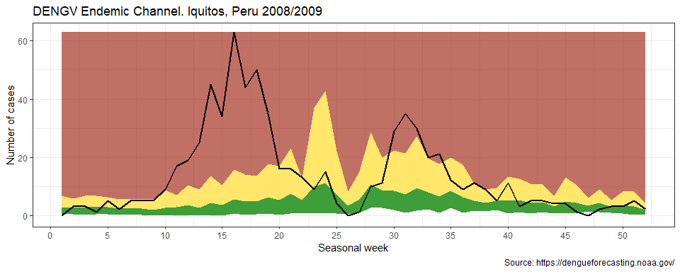

<!-- README.md is generated from README.Rmd. Please edit that file -->

# epichannel

<!-- badges: start -->

[](https://www.tidyverse.org/lifecycle/#experimental)
[](https://cran.r-project.org/package=epichannel)
<!-- badges: end -->

The goal of epichannel is to create classical endemic channel for
Epidemiological Surveillance in Public Health.

## Installation

<!-- You can install the released version of epichannel from [CRAN](https://CRAN.R-project.org) with: -->

``` r
#install.packages("epichannel")
devtools::install_github("avallecam/epichannel")
```

## Example

This is a basic example which shows you how to solve a common problem:

``` r
library(epichannel)
## basic example code
```

  - import data

<!-- end list -->

``` r
library(tidyverse)
#> -- Attaching packages ------------------------------------------------ tidyverse 1.2.1 --
#> v ggplot2 3.3.0     v purrr   0.3.3
#> v tibble  3.0.3     v dplyr   1.0.1
#> v tidyr   1.1.2     v stringr 1.4.0
#> v readr   1.3.1     v forcats 0.5.0
#> Warning: package 'ggplot2' was built under R version 3.6.3
#> Warning: package 'tibble' was built under R version 3.6.3
#> Warning: package 'dplyr' was built under R version 3.6.3
#> Warning: package 'forcats' was built under R version 3.6.3
#> -- Conflicts --------------------------------------------------- tidyverse_conflicts() --
#> x dplyr::filter() masks stats::filter()
#> x dplyr::lag()    masks stats::lag()

dengv <-
  readr::read_csv("https://dengueforecasting.noaa.gov/Training/Iquitos_Training_Data.csv") %>%
  mutate(year = lubridate::year(week_start_date),
         epiweek = lubridate::epiweek(week_start_date)) %>%
  mutate(adm="iquitos") %>%
  # cases per season - replace wiht a dummy year
  mutate(year = str_replace(season,"(.+)/(.+)","\\1") %>% as.double())
#> Parsed with column specification:
#> cols(
#>   season = col_character(),
#>   season_week = col_double(),
#>   week_start_date = col_date(format = ""),
#>   denv1_cases = col_double(),
#>   denv2_cases = col_double(),
#>   denv3_cases = col_double(),
#>   denv4_cases = col_double(),
#>   other_positive_cases = col_double(),
#>   total_cases = col_double()
#> )

# dengv %>% count(year,season,lag_year)

dengv %>% glimpse()
#> Rows: 468
#> Columns: 12
#> $ season               <chr> "2000/2001", "2000/2001", "2000/2001", "2...
#> $ season_week          <dbl> 1, 2, 3, 4, 5, 6, 7, 8, 9, 10, 11, 12, 13...
#> $ week_start_date      <date> 2000-07-01, 2000-07-08, 2000-07-15, 2000...
#> $ denv1_cases          <dbl> 0, 0, 0, 0, 0, 0, 0, 0, 0, 0, 0, 0, 0, 0,...
#> $ denv2_cases          <dbl> 0, 0, 0, 0, 0, 0, 0, 0, 0, 0, 0, 0, 0, 0,...
#> $ denv3_cases          <dbl> 0, 0, 0, 0, 0, 0, 0, 0, 0, 0, 0, 0, 0, 0,...
#> $ denv4_cases          <dbl> 0, 0, 0, 0, 0, 0, 0, 0, 0, 0, 0, 0, 0, 0,...
#> $ other_positive_cases <dbl> 0, 0, 0, 0, 0, 0, 0, 0, 0, 0, 1, 0, 0, 0,...
#> $ total_cases          <dbl> 0, 0, 0, 0, 0, 0, 0, 0, 0, 0, 1, 0, 0, 0,...
#> $ year                 <dbl> 2000, 2000, 2000, 2000, 2000, 2000, 2000,...
#> $ epiweek              <dbl> 26, 27, 28, 29, 30, 31, 32, 33, 34, 35, 3...
#> $ adm                  <chr> "iquitos", "iquitos", "iquitos", "iquitos...

# dengv %>%
#   ggplot(aes(x = week_start_date,y = total_cases)) +
#   geom_col()

popdb <-
  readr::read_csv("https://dengueforecasting.noaa.gov/PopulationData/Iquitos_Population_Data.csv") %>%
  janitor::clean_names() %>%
  mutate(adm="iquitos")
#> Parsed with column specification:
#> cols(
#>   Year = col_double(),
#>   Estimated_population = col_double()
#> )

popdb %>% glimpse()
#> Rows: 15
#> Columns: 3
#> $ year                 <dbl> 2000, 2001, 2002, 2003, 2004, 2005, 2006,...
#> $ estimated_population <dbl> 386666, 393355, 399770, 405988, 412095, 4...
#> $ adm                  <chr> "iquitos", "iquitos", "iquitos", "iquitos...

# popdb %>% count(year)
# dengv %>% count(year)
# dengv %>% left_join(popdb)
```

  - first, adapt

<!-- end list -->

``` r
epi_adapted <-
  epi_adapt_timeserie(db_disease = dengv,
                      db_population = popdb,
                      var_admx = adm,
                      # var_year = year, # must be a common variable between datasets
                      # var_week = epiweek,
                      var_year = year, # not working - need to create pseudo-years
                      var_week = season_week,
                      var_event_count = total_cases,
                      var_population = estimated_population)
#> Joining, by = c("var_admx", "var_year")
```

  - second, filter

<!-- end list -->

``` r
disease_now <- epi_adapted %>%
  filter(var_year==max(var_year))

disease_pre <- epi_adapted %>%
  filter(var_year!=max(var_year))
```

  - third, create

<!-- end list -->

``` r
disease_channel <-
  epi_create_channel(time_serie = disease_pre,
                     disease_name = "dengv")
#> Joining, by = "var_admx"

disease_channel
#> # A tibble: 52 x 6
#>    var_admx var_week median  low_95 upp_95 key  
#>    <fct>       <dbl>  <dbl>   <dbl>  <dbl> <chr>
#>  1 iquitos         1   2.80  0.267    6.80 dengv
#>  2 iquitos         2   2.64  0.484    5.82 dengv
#>  3 iquitos         3   2.78  0.259    6.75 dengv
#>  4 iquitos         4   2.86  0.424    6.62 dengv
#>  5 iquitos         5   2.72  0.454    6.12 dengv
#>  6 iquitos         6   2.25  0.127    5.44 dengv
#>  7 iquitos         7   2.22  0.0474   5.52 dengv
#>  8 iquitos         8   2.34  0.167    5.61 dengv
#>  9 iquitos         9   1.82 -0.420    5.44 dengv
#> 10 iquitos        10   2.66 -0.513    8.65 dengv
#> # ... with 42 more rows
```

  - fourth, join and ggplot

<!-- end list -->

``` r
epi_join_channel(disease_channel = disease_channel,
                 disease_now = disease_now) %>%
  # ggplot
  epi_plot_channel() +
  labs(title = "DENGV Endemic Channel. Iquitos, Peru 2008/2009",
       caption = "Source: https://dengueforecasting.noaa.gov/",
       # x = "epiweeks",
       x = "Seasonal week",
       y = "Number of cases") +
  theme_bw()
#> Joining, by = c("var_admx", "var_week")
```


