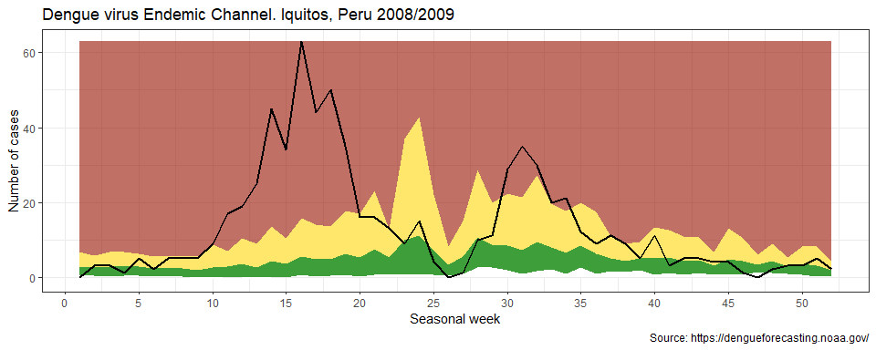

<!-- README.md is generated from README.Rmd. Please edit that file -->

# epichannel

<!-- badges: start -->

[](https://www.tidyverse.org/lifecycle/#experimental)
[](https://cran.r-project.org/package=epichannel)
<!-- badges: end -->

The goal of epichannel is to create classical endemic channel for
Epidemiological Surveillance in Public Health.

## Installation

<!-- You can install the released version of epichannel from [CRAN](https://CRAN.R-project.org) with: -->

``` r
#install.packages("epichannel")
devtools::install_github("avallecam/epichannel")
```

## Example

This is a basic example which shows you how to solve a common problem:

``` r
library(epichannel)
## basic example code
```

  - First, *read* surveillance data.

<!-- end list -->

``` r
library(tidyverse)

# disease dataset
dengv <-
  readr::read_csv("https://dengueforecasting.noaa.gov/Training/Iquitos_Training_Data.csv") %>%
  mutate(year = lubridate::year(week_start_date),
         epiweek = lubridate::epiweek(week_start_date)) %>%
  mutate(adm="iquitos") %>%
  # cases per season - replace wiht a dummy year
  mutate(year = str_replace(season,"(.+)/(.+)","\\1") %>% as.double())

dengv %>% glimpse()
#> Rows: 468
#> Columns: 12
#> $ season               <chr> "2000/2001", "2000/2001", "2000/2001", "2...
#> $ season_week          <dbl> 1, 2, 3, 4, 5, 6, 7, 8, 9, 10, 11, 12, 13...
#> $ week_start_date      <date> 2000-07-01, 2000-07-08, 2000-07-15, 2000...
#> $ denv1_cases          <dbl> 0, 0, 0, 0, 0, 0, 0, 0, 0, 0, 0, 0, 0, 0,...
#> $ denv2_cases          <dbl> 0, 0, 0, 0, 0, 0, 0, 0, 0, 0, 0, 0, 0, 0,...
#> $ denv3_cases          <dbl> 0, 0, 0, 0, 0, 0, 0, 0, 0, 0, 0, 0, 0, 0,...
#> $ denv4_cases          <dbl> 0, 0, 0, 0, 0, 0, 0, 0, 0, 0, 0, 0, 0, 0,...
#> $ other_positive_cases <dbl> 0, 0, 0, 0, 0, 0, 0, 0, 0, 0, 1, 0, 0, 0,...
#> $ total_cases          <dbl> 0, 0, 0, 0, 0, 0, 0, 0, 0, 0, 1, 0, 0, 0,...
#> $ year                 <dbl> 2000, 2000, 2000, 2000, 2000, 2000, 2000,...
#> $ epiweek              <dbl> 26, 27, 28, 29, 30, 31, 32, 33, 34, 35, 3...
#> $ adm                  <chr> "iquitos", "iquitos", "iquitos", "iquitos...

# population dataset
popdb <-
  readr::read_csv("https://dengueforecasting.noaa.gov/PopulationData/Iquitos_Population_Data.csv") %>%
  janitor::clean_names() %>%
  mutate(adm="iquitos")

popdb %>% glimpse()
#> Rows: 15
#> Columns: 3
#> $ year                 <dbl> 2000, 2001, 2002, 2003, 2004, 2005, 2006,...
#> $ estimated_population <dbl> 386666, 393355, 399770, 405988, 412095, 4...
#> $ adm                  <chr> "iquitos", "iquitos", "iquitos", "iquitos...
```

  - Second, *adapt* both datasets

<!-- end list -->

``` r
epi_adapted <-
  epi_adapt_timeserie(db_disease = dengv,
                      db_population = popdb,
                      var_admx = adm,
                      var_year = year, # must be a common variable name between datasets
                      var_week = season_week,
                      # var_year = year, 
                      # var_week = epiweek,
                      var_event_count = total_cases,
                      var_population = estimated_population)
#> Joining, by = c("var_admx", "var_year")
```

  - Third, *filter* by year to discriminate between the historical and
    current data

<!-- end list -->

``` r
disease_now <- epi_adapted %>%
  filter(var_year==max(var_year))

disease_pre <- epi_adapted %>%
  filter(var_year!=max(var_year))
```

  - Fourth, *create* the **endemic channel**
    
      - here you can choose between three available methods (Bortman
        [1999](#ref-bortman1999elaboracion)):
        
          - `"gmean_1sd"` is geometric mean with 1 standard deviation
            (default).
          - `"gmean_2sd"` is geometric mean with 2 sd.
          - `"gmean_ci"` is geometric mean with 95 percent confidence
            intervals.

<!-- end list -->

``` r
disease_channel <-
  epi_create_channel(time_serie = disease_pre,
                     disease_name = "dengv",
                     method = "gmean_1sd")
#> Joining, by = "var_admx"

disease_channel
#> # A tibble: 52 x 6
#>    var_admx var_week median  low_95 upp_95 key  
#>    <fct>       <dbl>  <dbl>   <dbl>  <dbl> <chr>
#>  1 iquitos         1   2.80  0.267    6.80 dengv
#>  2 iquitos         2   2.64  0.484    5.82 dengv
#>  3 iquitos         3   2.78  0.259    6.75 dengv
#>  4 iquitos         4   2.86  0.424    6.62 dengv
#>  5 iquitos         5   2.72  0.454    6.12 dengv
#>  6 iquitos         6   2.25  0.127    5.44 dengv
#>  7 iquitos         7   2.22  0.0474   5.52 dengv
#>  8 iquitos         8   2.34  0.167    5.61 dengv
#>  9 iquitos         9   1.82 -0.420    5.44 dengv
#> 10 iquitos        10   2.66 -0.513    8.65 dengv
#> # ... with 42 more rows
```

  - Finally, *join* datasets and *plot* it with ggplot

<!-- end list -->

``` r
epi_join_channel(disease_channel = disease_channel,
                 disease_now = disease_now) %>%
  # ggplot
  epi_plot_channel() +
  labs(title = "DENGV Endemic Channel. Iquitos, Peru 2008/2009",
       caption = "Source: https://dengueforecasting.noaa.gov/",
       # x = "epiweeks",
       x = "Seasonal week",
       y = "Number of cases") +
  theme_bw()
#> Joining, by = c("var_admx", "var_week")
```



## Contribute

Feel free to fill an issue with a
[`reprex`](https://reprex.tidyverse.org/) or implement new methods
through a pull request. Here are some alternatives:

  - Orellano and Reynoso ([2011](#ref-orellano2011nuevo))
  - Hernández et al.
    ([2016](#ref-Hernández_Arboleda_Arce_Benavides_Tejada_Ramírez_Cubides_2016))
  - Bowman ([2016](#ref-Bowman2016))

## More

For a more advanced approach into surveillance algorithms refer to the
`surveillance` R package and associated publications:

  - Höhle ([2007](#ref-hohle2007tt))
  - Salmon, Schumacher, and Höhle ([2016](#ref-monitoring2016))
  - Meyer, Held, and Höhle ([2017](#ref-modeling2017))
  - Salmon et al. ([2016](#ref-germany2016))

## References

<div id="refs" class="references">

<div id="ref-bortman1999elaboracion">

Bortman, Marcelo. 1999. “Elaboración de Corredores O Canales Endémicos
Mediante Planillas de cálculo.” *Revista Panamericana de Salud Pública*
5: 1–8.

</div>

<div id="ref-Bowman2016">

Bowman, Gustavo S. AND Coelho, Leigh R. AND Tejeda. 2016. “Alarm
Variables for Dengue Outbreaks: A Multi-Centre Study in Asia and Latin
America.” *PLOS ONE* 11 (6): 1–23.
<https://doi.org/10.1371/journal.pone.0157971>.

</div>

<div id="ref-Hernández_Arboleda_Arce_Benavides_Tejada_Ramírez_Cubides_2016">

Hernández, Mauricio, Diana Arboleda, Stephania Arce, Allan Benavides,
Paola Andrea Tejada, Sindy Vanessa Ramírez, and Ángela Cubides. 2016.
“Metodología Para La Elaboración de Canales Endémicos Y Tendencia de
La Notificación Del Dengue, Valle Del Cauca, Colombia, 2009-2013.”
*Biomédica* 36 (Sup2): 98–107.
<https://doi.org/10.7705/biomedica.v36i0.2934>.

</div>

<div id="ref-hohle2007tt">

Höhle, Michael. 2007. *Computational Statistics* 22 (4): 571–82.
<https://doi.org/https://doi.org/10.1007/s00180-007-0074-8>.

</div>

<div id="ref-modeling2017">

Meyer, Sebastian, Leonhard Held, and Michael Höhle. 2017.
“Spatio-Temporal Analysis of Epidemic Phenomena Using the R Package
surveillance.” *Journal of Statistical Software* 77 (11): 1–55.
<https://doi.org/10.18637/jss.v077.i11>.

</div>

<div id="ref-orellano2011nuevo">

Orellano, Pablo Wenceslao, and Julieta Itatı́ Reynoso. 2011. “Nuevo
Método Para Elaborar Corredores Endémicos.” *Revista Panamericana de
Salud Pública* 29: 309–14.

</div>

<div id="ref-germany2016">

Salmon, Maëlle, Dirk Schumacher, Hendrik Burmann, Christina Frank,
Hermann Claus, and Michael Höhle. 2016. “A System for Automated Outbreak
Detection of Communicable Diseases in Germany.” *Eurosurveillance* 21
(13).
<https://doi.org/https://doi.org/10.2807/1560-7917.ES.2016.21.13.30180>.

</div>

<div id="ref-monitoring2016">

Salmon, Maëlle, Dirk Schumacher, and Michael Höhle. 2016. “Monitoring
Count Time Series in R: Aberration Detection in Public Health
Surveillance.” *Journal of Statistical Software* 70 (10): 1–35.
<https://doi.org/10.18637/jss.v070.i10>.

</div>

</div>
